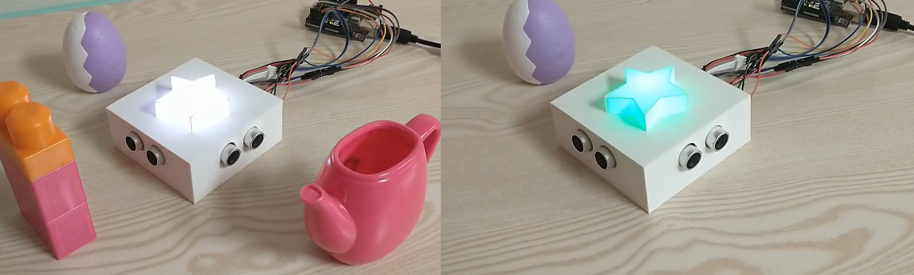
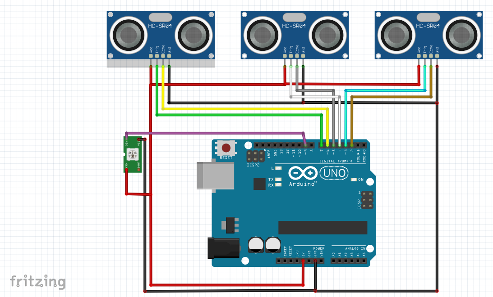

# About

A simple sonar sensor and rgb led project to show off different levels of color channels using physical objects.

# Parts needed

3x sonar sensors
1x arduino uno
1x ws2812b rbg led
Hookup wires

3d printed case and star
Hot glue gun

# Circuit Diagram

# Assembly

Splice hook up wires for voltage and ground for all the components. Or use a Breadboard to hook up voltage and ground power rails.

Hook up the 3x sensors according to the diagram. 

Hook up the ws2812b rgb led according to diagram.

Flash Aruino with code.

Insert sonar sensors into case and use glue gun to affix them.

Insert ws2812b rgb through top square hole in case and use glue gun to glue it to case.

